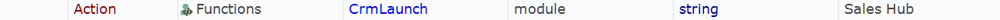
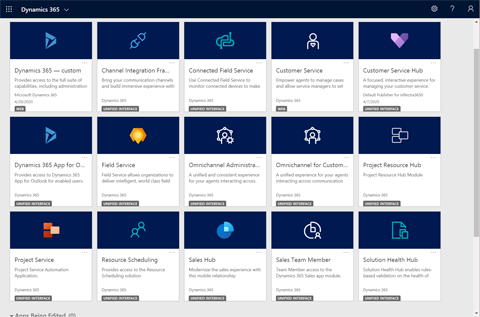
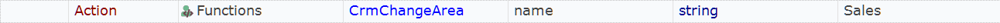
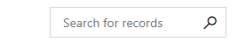

# Overview

Framework for testing Microsoft Dynamics 365 for Sales.

- Reusable functions are defined in `User.js`.
- Data for each test case is defined in `Data.xlsx`.
- `Dropdowns.xlsx` contains lists of values for [RVL dropdowns](https://rapisedoc.inflectra.com/Guide/rvl_editor/#param-dropdowns).
- `Output.xlsx` is used to persist data between test executions (see SetOutputValue, GetOutputValue common functions below).
 
The way of test parameterization and reading data from an Excel spreadsheet is described in the docs:

[Data-Driven Testing](https://rapisedoc.inflectra.com/Guide/ddt/)

## Browser Profiles

The framework includes a [local browser profile](https://rapisedoc.inflectra.com/Guide/browser_settings/#local-browser-profiles) located in `Profiles\BrowserProfiles` folder. It is a profile for Chrome. The profile to use is specified in `User.js` file and is used globally by all test cases:

```javascript
g_browserLibrary = "Chrome";
```

You may change the profile in `User.js` or pass `g_browserLibrary` value from SpiraTest or via command line.

## Common Functions

All functions are defined in [User.js](User.js). Look into this file for details.

### CrmLaunch

Launches specific app of Dynamics 365 in a browser. `Dynamics365Url`, `UserName`, `Password` must be set in `Config.xlsx`.





### CrmLaunchSales

Launches Dynamics 365 for Sales in a browser. `Dynamics365SalesUrl`, `UserName`, `Password` must be set in `Config.xlsx`.


### CrmChangeArea

Changes area in the left bottom corner of the dashboard.




### CrmOpenEntity

Opens entity in the site map.


### CrmClickButton

Clicks button on a toolbar.


### CrmSelectTab

Selects tab on the page.


### CrmLookupField

Selects value from a lookup field.


### SrmScrollTo

Scrolls to an element with given `data-id` attribute value. To find out the data-id you may use `//div[@data-id]` query in the Web Spy.

### CrmSetDate

Sets value to a date field.


### CrmSearchRecords

Searches for records.




### SetOutputValue

Writes key/value pair to Output.xlsx


### GetOutputValue

Reads value from Output.xlsx

